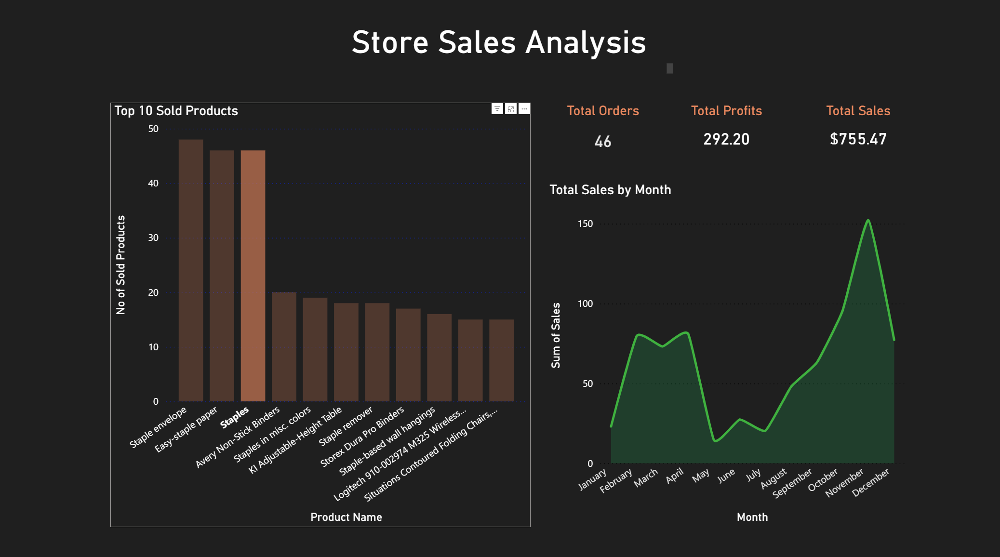
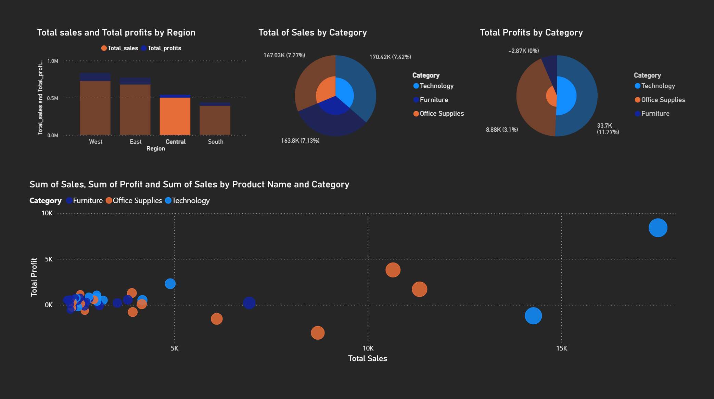

# superstore-powerbi-sql-project
This project focuses on analyzing retail sales data using SQL for data extraction and Power BI for visualization. The goal is to transform raw Superstore transactional data into meaningful business insights such as sales performance, profit trends, regional analysis, and product-level performance.

 -------------------SQL Analysis Performed-----------------------

 1. KPI Analysis
- Total Sales
- Total Profit
- Total Orders
- Average Sales per Order

These KPIs help understand overall business performance.

 2. Regional Analysis
- Sales by Region (East, West, Central, South)
- Profit distribution across regions
- Identification of high-performing and low-performing regions

 3. Product Analysis
- Top 10 products by sales
- Sub-category performance analysis
- Product-level profit comparison

This helps identify best-selling and underperforming products.

4. Category Analysis
- Sales and profit across Furniture, Technology, and Office Supplies
- Comparison of category profitability

5. Time-Based Analysis
- Monthly sales trends
- Seasonal sales patterns

----------------------Power BI Dashboard-----------------------

The Power BI dashboard includes:

KPI Cards:
- Total Sales
- Total Profit
- Total Orders

Visualizations:
- Monthly Sales Trend (Line Chart)
- Sales by Region (Bar Chart)
- Top 10 Products (Bar Chart)
- Profit vs Sales Relationship (Scatter Plot)
- Category Performance Breakdown

Features:
- Interactive filters (Region, Category, Date)
- Dynamic visual storytelling
- Clean and structured layout for business insights

Insights:
- Certain regions consistently outperform others in both sales and profit.
- A small set of products contributes to a large portion of total revenue.
- Some high-sales products show low or negative profit margins.
- Technology category generally shows stronger profitability compared to others.

 Outcome:
This project demonstrates skills in:
- SQL data extraction & aggregation
- Business KPI development
- Data visualization using Power BI
- Analytical thinking and storytelling with data

Dashboard Preview

Author
Athithyan A
